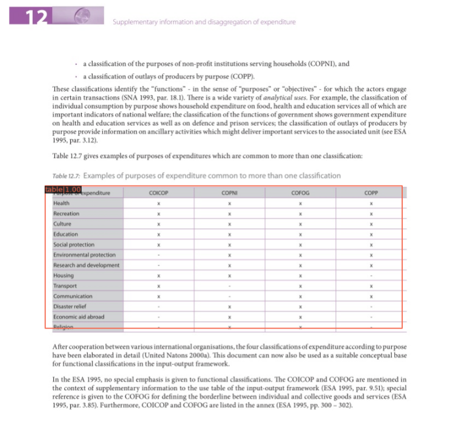

# Swin Transformer for Table Detection

This repo is based on [Swin Transformer for Object Detection](https://github.com/SwinTransformer/Swin-Transformer-Object-Detection). A Faster RCNN with [Swin Transformer](https://arxiv.org/pdf/2103.14030.pdf) backbone config file, dataset and a script for transforming dataset into COCO format are included.

## How to use
Run [Swin\_Transformer\_Table\_Detection.ipynb](https://github.com/tinahhhhh/Table-Detection/blob/master/Swin_Transformer_Table_Detection.ipynb). 

 

## Results

12 epochs:    
Average Precision  (AP) @[ IoU=0.50:0.95 | area=   all | maxDets=100 ] = 0.855  
Average Precision  (AP) @[ IoU=0.50      | area=   all | maxDets=1000 ] = 0.931  
Average Precision  (AP) @[ IoU=0.75      | area=   all | maxDets=1000 ] = 0.921  
Average Precision  (AP) @[ IoU=0.50:0.95 | area= small | maxDets=1000 ] = -1.000  
Average Precision  (AP) @[ IoU=0.50:0.95 | area=medium | maxDets=1000 ] = -1.000  
Average Precision  (AP) @[ IoU=0.50:0.95 | area= large | maxDets=1000 ] = 0.858  
Average Recall     (AR) @[ IoU=0.50:0.95 | area=   all | maxDets=100 ] = 0.895  
Average Recall     (AR) @[ IoU=0.50:0.95 | area=   all | maxDets=300 ] = 0.895  
Average Recall     (AR) @[ IoU=0.50:0.95 | area=   all | maxDets=1000 ] = 0.895  
Average Recall     (AR) @[ IoU=0.50:0.95 | area= small | maxDets=1000 ] = -1.000  
Average Recall     (AR) @[ IoU=0.50:0.95 | area=medium | maxDets=1000 ] = -1.000  
Average Recall     (AR) @[ IoU=0.50:0.95 | area= large | maxDets=1000 ] = 0.895    

2021-05-02 13:17:44,270 - mmdet - INFO - Epoch(val) [12][210]	bbox_mAP: 0.8550, bbox_mAP_50: 0.9310, bbox_mAP_75: 0.9210, bbox_mAP_s: -1.0000, bbox_mAP_m: -1.0000, bbox_mAP_l: 0.8580, bbox_mAP_copypaste: 0.855 0.931 0.921 -1.000 -1.000 0.858     

  
Result from cTDaR_t10499.jpg  

  

## Dataset
[cTDaR TRACKA](https://zenodo.org/record/2649217#.YInpcX0zZTZ)

## References
1. [Voc2coco](https://github.com/yukkyo/voc2coco)

2. [MMDetection document](https://mmdetection.readthedocs.io/en/latest/)